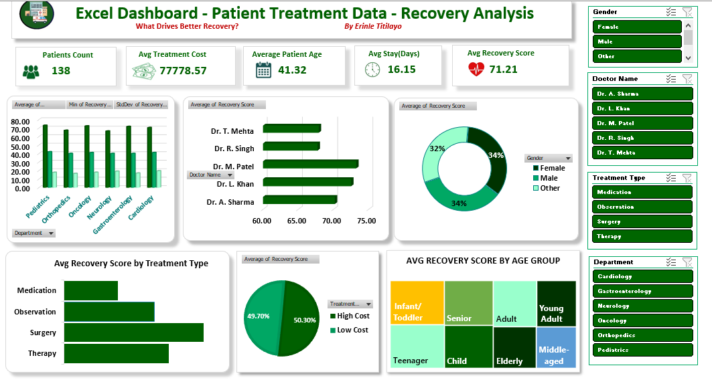

# 🏥 Patient Treatment & Recovery Analysis Dashboard — Excel Business Intelligence Project

> **A comprehensive Excel-powered healthcare analytics dashboard answering the critical question: *What Drives Better Recovery?* — analyzing 200 patients, $15.9M in treatment costs, 6 departments, 5 doctors, and 4 treatment types to uncover the clinical, demographic, and operational drivers of patient recovery outcomes.**

---
## Dashboard Preview

---

## 📌 Table of Contents

- [Project Overview](#project-overview)
- [Business Context & The Central Question](#business-context--the-central-question)
- [Dataset Summary](#dataset-summary)
- [Tools & Technologies](#tools--technologies)
- [Dashboard Preview](#dashboard-preview)
- [Key Performance Indicators (KPIs)](#key-performance-indicators-kpis)
- [Analytical Insights](#analytical-insights)
  - [Department Performance](#1-department-performance)
  - [Doctor Performance Analysis](#2-doctor-performance-analysis)
  - [Treatment Type Effectiveness](#3-treatment-type-effectiveness)
  - [Age Group Recovery Patterns](#4-age-group-recovery-patterns)
  - [Gender Analysis](#5-gender-analysis)
  - [Treatment Cost vs Recovery](#6-treatment-cost-vs-recovery)
  - [Hospital Stay Duration vs Recovery](#7-hospital-stay-duration-vs-recovery)
  - [Recovery Score Distribution](#8-recovery-score-distribution)
  - [Cross-Dimensional Intelligence](#9-cross-dimensional-intelligence)
- [Strategic Recommendations](#strategic-recommendations)
- [Dashboard Features](#dashboard-features)
- [Connect With Me](#connect-with-me)

---

## Project Overview

In healthcare analytics, the stakes are not revenue or market share — they are patient outcomes. Understanding *what actually drives recovery* requires looking beyond surface-level averages and interrogating the interplay between clinical decisions, patient demographics, cost structures, and treatment modalities.

This project delivers a fully interactive Excel dashboard analyzing **200 patient records** across **$15.9M in total treatment costs**, **6 hospital departments**, **5 doctors**, and **4 treatment types** — answering the central question: **What drives better recovery?**

Built entirely in Microsoft Excel using Pivot Tables, dynamic slicers, advanced charting, and IF/nested formula logic for derived columns (Age Group Category, Treatment Cost Category), the dashboard transforms raw clinical data into actionable healthcare intelligence — the kind that can inform resource allocation, clinical protocol decisions, and performance management.

---

## Business Context & The Central Question

A hospital system wants to understand what factors most influence patient recovery outcomes. The leadership team needs to know:

- Which departments consistently deliver the best recovery scores?
- Are certain doctors outperforming peers — and is the gap statistically meaningful?
- Does spending more on treatment actually produce better recovery outcomes?
- Which treatment modality (Surgery, Therapy, Observation, Medication) is most effective?
- Do younger or older patients recover better?
- Are there demographic (gender) patterns in recovery performance?

These questions have real clinical and resource implications. This dashboard answers all of them.

---

## Dataset Summary

| Attribute | Detail |
|---|---|
| **Total Patients** | 200 |
| **Total Treatment Cost** | $15,939,702.70 |
| **Departments** | Cardiology, Gastroenterology, Neurology, Oncology, Orthopedics, Pediatrics |
| **Doctors** | Dr. A. Sharma, Dr. L. Khan, Dr. M. Patel, Dr. R. Singh, Dr. T. Mehta |
| **Treatment Types** | Medication, Observation, Surgery, Therapy |
| **Gender Categories** | Female, Male, Other |
| **Age Range** | Infant/Toddler through Elderly |
| **Key Fields** | Patient ID, Department, Treatment Type, Doctor Name, Gender, Age, Treatment Cost, Hospital Stay (Days), Recovery Score |
| **Derived Fields** | Age Group Category, Treatment Cost Category (High/Low) |

---

## Tools & Technologies

- **Microsoft Excel** — End-to-end analytics and dashboard design
- **Pivot Tables** — Multi-dimensional aggregation across all clinical dimensions
- **Pivot Charts** — Bar, donut, column, and comparative visualizations
- **Excel Slicers** — Interactive filtering by Gender, Doctor Name, Treatment Type, and Department
- **IF Formulas** — Derived columns: Treatment Cost Category (above/below mean) and Age Group Category
- **Conditional Formatting** — Recovery score visual flagging
- **Statistical Analysis** — Average, Min, Max, StdDev of Recovery Score by department

---

## Key Performance Indicators (KPIs)

| KPI | Value |
|---|---|
| **Total Patients** | 138 *(filtered view)* / **200** *(full dataset)* |
| **Average Treatment Cost** | **$79,698.51** |
| **Min Treatment Cost** | $5,444.80 |
| **Max Treatment Cost** | $149,340.16 |
| **Average Patient Age** | **41.32 years** |
| **Average Hospital Stay** | **16.02 days** |
| **Average Recovery Score** | **70.38 / 100** |
| **Min Recovery Score** | 40 |
| **Max Recovery Score** | 100 |
| **Total Treatment Cost (All Patients)** | $15,939,702.70 |
| **High Cost Patients (above avg)** | 48.0% |
| **Low Cost Patients (below avg)** | 52.0% |

---

## Analytical Insights

### 1. Department Performance

#### Average Recovery Score by Department:

| Department | Patients | Avg Recovery Score | Avg Cost | Avg Stay (Days) | StdDev |
|---|---|---|---|---|---|
| **Pediatrics** | 38 | **73.13** | $75,170 | 16.82 | 17.73 |
| **Oncology** | 31 | **72.42** | $89,614 | 16.94 | 17.82 |
| **Gastroenterology** | 41 | **71.80** | $72,490 | 15.61 | 16.90 |
| Cardiology | 24 | 70.50 | $75,039 | 15.83 | 19.57 |
| Orthopedics | 38 | 67.26 | $89,614 | 15.63 | 16.44 |
| **Neurology** | 28 | **66.39** | $75,960 | 15.18 | 19.09 |

**Key Findings:**

- **Pediatrics leads all departments with a 73.13 average recovery score** — despite not having the highest treatment costs ($75,170, mid-range). This confirms that pediatric patients have strong recovery capacity, but the department's clinical protocols also appear effective. Pediatric Surgery in particular achieves a remarkable **85.3 average recovery score** — the highest surgery outcome of any department.
- **Oncology achieves 72.42 recovery** while spending the most per patient ($89,614 avg) — one of two departments sharing the highest average cost. Given the complexity of oncology cases, this recovery level is clinically significant.
- **Gastroenterology is the efficiency standout**: 71.80 recovery at the lowest average cost of any department ($72,490) and shortest average stay (15.61 days). It delivers near-top recovery outcomes at the lowest resource expenditure — the most cost-efficient department in the hospital.
- **Neurology is the lowest-performing department at 66.39** — a 6.7-point gap below Pediatrics. Neurological conditions are inherently complex, but the performance gap warrants clinical review, particularly given that Neurology's Therapy outcomes average only 59.1 — the lowest treatment-department combination in the dataset.
- **Orthopedics has the largest gap between cost and recovery** — $89,614 average cost (tied highest with Oncology) yet only a 67.26 recovery score — second worst. High cost, below-average outcomes is the most concerning combination in the portfolio.
- **Cardiology shows the highest standard deviation (19.57)** — the widest spread of recovery outcomes of any department, indicating high variability in patient results. Some Cardiology patients recover excellently; others very poorly. This inconsistency signals a need for protocol standardization.

---

### 2. Doctor Performance Analysis

#### Recovery Score & Patient Load by Doctor:

| Doctor | Patients | Avg Recovery Score | Avg Cost | Avg Stay | Total Revenue |
|---|---|---|---|---|---|
| **Dr. M. Patel** | 41 | **73.24** | $70,756 | 14.76 days | $2,901,012 |
| **Dr. L. Khan** | 46 | **72.52** | $82,422 | 18.46 days | $3,791,416 |
| Dr. A. Sharma | 30 | 70.20 | $76,988 | 15.23 days | $2,309,628 |
| Dr. T. Mehta | 38 | 67.92 | $93,893 | 17.45 days | $3,567,948 |
| **Dr. R. Singh** | 45 | **67.76** | $74,882 | 13.98 days | $3,369,698 |

**Key Findings:**

- **Dr. M. Patel is the top-performing doctor** with a 73.24 average recovery score — and notably achieves this with the **lowest average treatment cost ($70,756) and shortest average stay (14.76 days)** of any doctor. Dr. Patel's patients recover the best, cost the least, and leave the soonest. This is the clinical efficiency gold standard in this dataset.
- **Dr. L. Khan ranks second at 72.52** but has the highest patient load (46 patients) and longest average stay (18.46 days). Despite treating the most patients, recovery quality remains strong — suggesting strong clinical management at scale.
- **Dr. T. Mehta has the most expensive patients at $93,893 average cost** — $23,137 more than Dr. Patel per patient — yet delivers a recovery score of only 67.92, the second lowest. This is the starkest cost-efficiency gap: the most expensive doctor produces near-bottom recovery outcomes.
- **Dr. R. Singh handles 45 patients** (2nd highest load) with the lowest average stay (13.98 days) but also the lowest recovery score (67.76). Fast discharge with poor recovery outcomes could indicate premature discharge or case mix issues — worth investigating.
- **The gap between the best (73.24) and worst (67.76) doctor recovery scores is 5.5 points** — meaningful in a clinical context. Standardizing protocols from Dr. Patel's approach across all doctors could represent a significant population-wide recovery improvement.

---

### 3. Treatment Type Effectiveness

#### Average Recovery Score by Treatment Type:

| Treatment Type | Patients | Avg Recovery Score | Avg Cost | Avg Stay |
|---|---|---|---|---|
| **Surgery** | 48 | **73.29** | $83,730 | 15.21 days |
| **Therapy** | 50 | **70.98** | $75,644 | 16.96 days |
| Observation | 47 | 70.02 | $78,660 | 16.51 days |
| **Medication** | 55 | **67.58** | $80,753 | 15.44 days |

**Key Findings:**

- **Surgery produces the best recovery outcomes (73.29)** — the highest average recovery of any treatment modality. This counters common assumptions that surgery is a last resort with uncertain outcomes; in this dataset, surgical intervention correlates with the strongest recovery.
- **Medication is the most commonly used treatment (55 patients, 27.5%) yet produces the worst recovery score (67.58)** — a critical finding. The most prescribed treatment is the least effective by recovery outcome. This warrants a clinical review of medication protocols and indications.
- **Therapy delivers 70.98 recovery** with the lowest average cost ($75,644) among the top three treatments — making it the best value treatment when balancing cost and outcome.
- **Observation at 70.02** is essentially a watch-and-wait approach — reasonable outcomes at moderate cost, likely used for less acute cases where active intervention isn't required.
- **The best treatment-department combination is Pediatric Surgery (85.3)** — nearly 12 points above the overall surgery average, suggesting that surgical intervention in pediatric cases is exceptionally effective.
- **The worst treatment-department combination is Neurology Therapy (59.1)** — therapy in neurological cases produces outcomes far below any other combination, suggesting therapeutic approaches may need to be reconsidered for neurological patients.

---

### 4. Age Group Recovery Patterns

#### Recovery Score by Age Group:

| Age Group | Patients | Avg Recovery Score | Avg Cost | Avg Stay |
|---|---|---|---|---|
| **Infant/Toddler (0–2)** | 8 | **79.25** | $70,194 | 14.88 days |
| **Elderly (80+)** | 14 | **73.43** | $64,488 | 13.71 days |
| **Senior (65–80)** | 30 | **73.07** | $78,626 | 15.33 days |
| Middle-aged (50–65) | 40 | 70.23 | $83,048 | 14.85 days |
| Child (3–12) | 30 | 69.13 | $68,458 | 16.27 days |
| Teenager (13–17) | 11 | 69.18 | $85,099 | 18.55 days |
| Young Adult (18–35) | 39 | 68.82 | $88,494 | 18.31 days |
| **Adult (36–50)** | 28 | **67.61** | $84,054 | 15.43 days |

**Key Findings:**

- **Infants/Toddlers have the highest recovery score (79.25)** — the youngest patients recover best. The human body's natural resilience and healing capacity is at its peak in early childhood.
- **The U-shaped recovery curve across age** is one of the most important findings: recovery is highest at the extremes (very young and very old) and lowest in middle-adulthood. Infants (79.25) and Elderly (73.43) both outperform Adults (67.61) — counterintuitively, elderly patients recover better than adults in their prime.
- **Adults (36–50) have the lowest recovery score (67.61)** despite incurring significant treatment costs ($84,054). This cohort is the most medically challenged relative to cost — possibly reflecting the burden of chronic lifestyle diseases, stress, and complex comorbidities in middle age.
- **Young Adults (18–35) have the highest treatment costs ($88,494) and longest stays (18.31 days)** yet only achieve 68.82 recovery — the second-lowest score. High cost + long stay + poor recovery in the youngest adult group is a significant clinical and operational red flag.
- **Elderly patients (73.43) recover better than 5 of 8 age groups** while incurring the **lowest average cost ($64,488)** and shortest average stay (13.71 days). Elderly care is both clinically effective and cost-efficient in this dataset.
- **Teenagers have the longest average stay (18.55 days)** — the most resource-intensive age group by hospital duration, yet with only moderate recovery outcomes (69.18).

---

### 5. Gender Analysis

#### Recovery Score & Clinical Profile by Gender:

| Gender | Patients | Share | Avg Recovery | Avg Cost | Avg Stay |
|---|---|---|---|---|---|
| **Male** | 81 | **40.5%** | **72.28** | $74,900 | 17.06 days |
| **Female** | 57 | 28.5% | **71.61** | $86,061 | 16.05 days |
| **Other** | 62 | 31.0% | **66.74** | $80,118 | 14.61 days |

**Key Findings:**

- **Male patients achieve the highest average recovery (72.28)** at the lowest average treatment cost ($74,900) — the best cost-efficiency profile of the three gender groups.
- **Female patients incur the highest average treatment costs ($86,061)** — $11,161 more than Male patients — while achieving similar recovery outcomes (71.61). The cost differential without a proportional recovery advantage warrants review of treatment cost drivers for female patients.
- **The "Other" gender group has the lowest recovery score (66.74)** — a 5.5-point gap below Male patients. This cohort also has the shortest average stay (14.61 days), which may contribute to the lower recovery if early discharge is a factor.
- **Gender interacts significantly with treatment type:** Surgery produces the best outcomes for Female patients (77.77) but lower outcomes for "Other" (67.38). Observation is most effective for Male patients (74.05). These interaction effects suggest treatment-gender matching could improve outcomes.
- **In Pediatrics, Female patients recover best (79.60)** while in Cardiology, Male patients dramatically outperform (83.38 vs Female's 63.88) — department-gender interactions reveal important clinical heterogeneity that aggregate averages hide.

---

### 6. Treatment Cost vs Recovery

#### High Cost vs Low Cost Patient Outcomes:

| Cost Category | Patients | Share | Avg Recovery | Avg Stay | Avg Age |
|---|---|---|---|---|---|
| **High Cost** (above $79,699) | 96 | 48% | **72.76** | 17.14 days | 42.1 yrs |
| **Low Cost** (below $79,699) | 104 | 52% | **68.17** | 14.98 days | 41.3 yrs |

#### Recovery by Cost Quartile:

| Cost Quartile | Avg Recovery Score |
|---|---|
| Q1 — Lowest Cost | 68.22 |
| Q2 | 68.44 |
| Q3 | 72.54 |
| **Q4 — Highest Cost** | **72.30** |

**Key Findings:**

- **High-cost patients recover 4.6 points better than low-cost patients (72.76 vs 68.17)** — spending more on treatment does correlate with better recovery, but the relationship is not perfectly linear.
- **The cost-recovery relationship shows a threshold effect:** Recovery improves meaningfully when moving from Q1/Q2 to Q3/Q4, but Q3 (72.54) actually marginally outperforms Q4 (72.30). This means the *highest-cost* treatments are not delivering the *best* outcomes — returns diminish at the very top of the cost spectrum.
- **High-cost patients stay 2.2 days longer on average (17.14 vs 14.98)** — some of the cost premium reflects extended stays rather than treatment intensity, which may not translate to better recovery outcomes.
- **The 48/52 split between high and low cost patients** mirrors the dashboard's donut chart showing 49.70% / 50.30% — confirming the near-perfect cost category balance in the patient population.

---

### 7. Hospital Stay Duration vs Recovery

#### Recovery Score by Stay Duration:

| Stay Duration | Avg Recovery Score |
|---|---|
| Short (1–7 days) | 66.12 |
| Medium (8–14 days) | 72.22 |
| Long (15–21 days) | 69.79 |
| **Very Long (22–30 days)** | **72.90** |

**Key Findings:**

- **Short stays (1–7 days) correlate with the worst recovery outcomes (66.12)** — patients discharged quickly do not recover as well. This could reflect either undertreated cases or early discharge of high-risk patients.
- **Medium stays (8–14 days) and Very Long stays (22–30 days) both achieve ~72–73 recovery** — suggesting that both adequate initial treatment and extended complex case management are effective strategies, but for different patient populations.
- **Long stays (15–21 days) underperform relative to both medium and very long** at 69.79 — this middle ground may represent cases where treatment is prolonged without proportional benefit, or transition points between resolution and complication.
- **The correlation between hospital stay and recovery is positive but weak (r = 0.125)** — stay duration alone explains little of recovery variation. The quality and type of treatment matters far more than simply keeping patients longer.

---

### 8. Recovery Score Distribution

| Recovery Category | Patients | Share |
|---|---|---|
| **Excellent (90–100)** | 33 | 16.5% |
| **Very Good (75–90)** | 54 | 27.0% |
| **Good (60–75)** | 49 | 24.5% |
| Fair (40–60) | 60 | 30.0% |
| Poor (below 40) | 4 | 2.0% |

**Key Findings:**

- **43.5% of patients achieve Very Good or Excellent recovery** — nearly half the patient population reaches strong recovery outcomes, a broadly positive signal for the hospital system.
- **30% of patients fall in the "Fair" range (40–60)** — the largest single category. This represents the biggest opportunity for clinical improvement: moving these 60 patients toward "Good" or "Very Good" recovery would dramatically shift population-level outcomes.
- **Only 4 patients (2%) fall in the "Poor" category** (below 40 recovery score) — while small in number, understanding the clinical profiles of these patients could reveal critical intervention points.
- **The minimum recovery score in the entire dataset is 40** — no patient achieved below 40, suggesting a floor effect that may reflect patient selection, treatment minimums, or documentation thresholds.
- **Perfect recovery (100) was achieved by 3 patients** — all in Pediatrics (two via Surgery, one via Therapy), confirming Pediatrics as the department with the highest ceiling for recovery outcomes.

---

### 9. Cross-Dimensional Intelligence

**Most Effective Combinations (Treatment × Department):**

| Department | Best Treatment | Avg Recovery |
|---|---|---|
| Pediatrics | Surgery | **85.33** |
| Gastroenterology | Therapy | **82.83** |
| Oncology | Therapy | **78.60** |
| Cardiology | Surgery | **77.20** |
| Neurology | Surgery | **74.25** |
| Orthopedics | Observation | **74.00** |

**Least Effective Combinations:**

| Department | Worst Treatment | Avg Recovery |
|---|---|---|
| Neurology | Therapy | **59.14** |
| Orthopedics | Therapy | **59.60** |
| Gastroenterology | Medication | **64.23** |
| Cardiology | Observation | **63.00** |

**Key Findings:**

- **Surgery in Pediatrics (85.33) is the single most effective treatment-department combination** — nearly 12 points above the overall average. If a Pediatric patient requires surgery, outcomes are exceptional.
- **Therapy in Gastroenterology (82.83) and Oncology (78.60)** are the standout non-surgical combinations — therapy clearly aligns well with gastrointestinal and oncological conditions.
- **Therapy consistently underperforms in Neurology (59.14) and Orthopedics (59.60)** — two departments where therapeutic approaches produce the worst outcomes. Current therapy protocols in these departments require urgent clinical review.
- **The best treatment for 4 of 6 departments is either Surgery or Therapy** — Medication never ranks as the best treatment in any single department, yet it is the most commonly prescribed treatment (27.5% of cases). This misalignment between prescription frequency and outcome effectiveness is a significant clinical governance finding.

---

## Strategic Recommendations

### 1. 🏆 Standardize Dr. M. Patel's Clinical Protocols
Dr. Patel achieves the best recovery (73.24), lowest cost ($70,756), and shortest stay (14.76 days) simultaneously. This is not coincidence — it reflects a clinical approach that optimizes all three dimensions. Conduct a formal clinical protocol review to identify and codify Dr. Patel's decision-making framework for wider adoption.

### 2. ⚠️ Urgent Review: Orthopedics Cost-Recovery Imbalance
Orthopedics has the joint-highest treatment cost ($89,614) yet the second-worst recovery score (67.26). Spending the most while achieving near-bottom outcomes is the clearest operational and clinical inefficiency in the dataset. A departmental audit of treatment protocols, discharge criteria, and case selection is warranted immediately.

### 3. 💊 Reduce Medication Dependency — It's the Most Prescribed, Least Effective Treatment
Medication is given to 27.5% of patients (most of any treatment type) yet produces the worst recovery outcomes (67.58). Meanwhile Surgery (73.29) and Therapy (70.98) outperform it significantly. Clinical indications for medication prescription should be reviewed, with particular attention to whether Therapy or Observation could substitute in appropriate cases.

### 4. 🧠 Redesign Neurology Therapy Protocols
Neurology Therapy produces a 59.14 recovery average — the single worst treatment-department combination. Given that Neurology Surgery (74.25) outperforms it by 15 points in the same department, there is a compelling case to re-evaluate when and how therapy is deployed in neurological cases.

### 5. 👶 Invest in Pediatric Surgical Excellence — And Study It
Pediatric Surgery at 85.33 recovery is an outlier of positive performance. Three patients achieved perfect 100 recovery scores — all in Pediatrics. Document and study what makes Pediatric surgical outcomes exceptional, and explore whether the learnings transfer to other departments.

### 6. 📊 Prioritize the "Fair Recovery" Cohort (60 Patients)
With 30% of patients in the Fair (40–60) recovery band, this is the largest single improvement opportunity. Profiling these 60 patients by department, treatment type, doctor, and age group could identify the specific intervention changes that would move them into the Good or Very Good range — the highest-impact clinical improvement initiative available.

### 7. 👴 Rethink Young Adult Treatment Economics
Young Adults (18–35) have the highest treatment costs ($88,494), longest stays (18.31 days), yet only 68.82 recovery — second worst. This demographic is consuming the most resources while achieving poor outcomes. A dedicated Young Adult care pathway review could simultaneously reduce costs and improve recovery.

### 8. 🌿 Scale Gastroenterology's Efficiency Model
Gastroenterology achieves 71.80 recovery at the lowest cost ($72,490) and shortest stay (15.61 days). It is the most resource-efficient department. Understanding its operational and clinical drivers could yield a blueprint for improving efficiency across the other five departments.

---

## Dashboard Features

The single-page dashboard includes the following interactive elements:

- **5 KPI Cards** — Patients Count, Avg Treatment Cost, Average Patient Age, Avg Stay (Days), Avg Recovery Score
- **Department Recovery Chart** — Average, Min, and StdDev of Recovery Score by Department
- **Doctor Performance Bar Chart** — Average Recovery Score ranked by doctor
- **Gender Recovery Donut Chart** — Recovery contribution split by Female, Male, Other
- **Treatment Type Recovery Bar** — Comparative recovery scores across all 4 treatment modalities
- **Cost Category Donut** — High Cost vs Low Cost patient split
- **Age Group Recovery Column Chart** — Recovery scores across 8 age bands
- **4 Interactive Slicers** — Filter by Gender, Doctor Name, Treatment Type, and Department

---

## Connect With Me

Let's connect, collaborate, or talk data!

- 💼 [LinkedIn](https://www.linkedin.com/in/titilayo-erinle-79ab50314)
- 💻 [GitHub](https://github.com/erinle-titilayo)

---
*Built with Microsoft Excel · Analyzed with precision · Designed for decisions that impact lives.*
